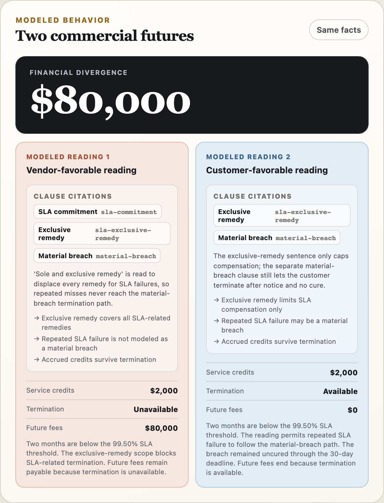
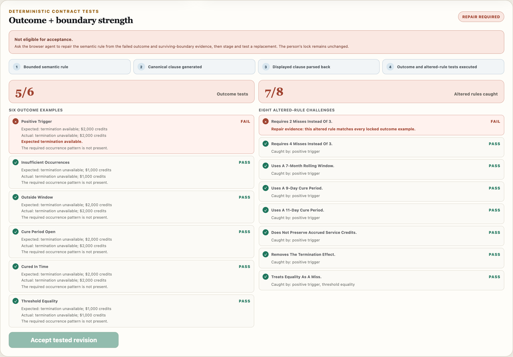

# ClauseProof — unit tests for contract language

**One SLA clause. Two reasonable readings. $80,000 apart.**

ClauseProof is a web app where a browser agent and a person fix an ambiguous contract clause together, and the page proves the fix works before anyone accepts it. The agent works through six WebMCP tools registered by the page. The person keeps the two decisions that matter: what the clause should mean, and whether to accept the tested wording.

- Live app: <https://by42ppcrps-dev.github.io/clauseproof/> (no login; open it in ChatGPT's built-in browser, or in Chrome 149+ with WebMCP enabled)
- Source: <https://github.com/by42ppcrps-dev/clauseproof> (MIT). A mirror stays at <https://github.com/lumegridai-ops/clauseproof> with its own copy of the site at <https://lumegridai-ops.github.io/clauseproof/>, so links in the demo video keep working.
- Demo video (2:14): <https://youtu.be/9pREoz_-GjI>
- Built for the [WebMCP Challenge](https://webmcp.devpost.com/), August 28 to September 3, 2026

> ClauseProof tests modeled commercial behavior in one synthetic agreement. It does not parse arbitrary contracts, predict a court ruling, determine enforceability, or provide legal advice.



## What happens in three minutes

1. **The agent stages two readings.** You paste the on-page prompt into your browser agent. Through WebMCP it reads the three clauses, stages a vendor-favorable reading (service credits are the only remedy, so repeated misses are never a material breach) and a customer-favorable reading (credits only cap compensation, so termination for breach survives), and runs both.
2. **The page runs the numbers.** Same facts for both: uptime of 98.7% and 98.9% in consecutive months, a $10,000 monthly fee, eight months left, notice on March 1, no cure. Reading A: $2,000 in credits, no exit, $80,000 still owed. Reading B: $2,000 in credits, exit available, $0 owed. Then ask a what-if: "what if March also missed?" The agent changes the facts through a tool, the page re-runs both readings on the new facts, and the gap moves. Facts can change only before you lock intent; the lock snapshots them.
3. **You lock intent.** You say what the clause should mean: two misses within six months, written notice, a ten-day cure, termination without penalty, credits preserved. There is no WebMCP tool for this step. Only a person can lock intent, and the agent's tool list visibly changes when you do.
4. **The agent proposes, the page tests.** The agent submits a structured rule, not prose. The page compiles the rule into exact clause wording, parses the wording back into a rule, checks they agree, then runs six outcome examples and eight altered-rule challenges against it. In the walkthrough the agent first tries a three-miss rule: 5 of 6 outcome tests pass, 7 of 8 altered rules are caught, and the failing test says exactly why.
5. **The agent repairs from the counterexample.** It changes only the occurrence count. 6 of 6 and 8 of 8. The page marks it eligible, but the agent still cannot accept.
6. **You accept.** Revision 1. The proof ledger keeps the wrong candidate, the failing test, the repair, the pass, and your acceptance, each attributed to whoever actually did it.



## Why this needs WebMCP

A chat window can talk about a clause. It cannot act inside the review without a way to touch live page state safely. WebMCP gives the agent a narrow, typed contract with the page:

- **Live state, not screenshots.** Every call carries the page's current revision and artifact IDs. Acting on a stale revision, a wrong outcome-lock ID, or an unknown clause fails with a stable error code and one recovery action.
- **Structured input, deterministic output.** The agent never calculates money, dates, rolling windows, or test results. It supplies semantics; the page executes them. Inputs are strict Zod schemas compiled to JSON Schema with plain-English field descriptions, so a natural prompt is enough.
- **Phase-aware tools.** The page registers only the tools that make sense right now and revokes the rest through the registration `AbortSignal`. The authority panel on the page shows the same mapping the registry enforces.
- **Machine-readable failure.** A failed verification returns the exact failing test and the surviving altered rule. That is what lets the agent repair instead of guess.
- **Enforced human authority.** Lock, accept, and reset exist only in the UI. The WebMCP layer is handed a frozen port that has no such methods, and the audit trail cannot record an agent action as a person's.

Without WebMCP the same page still works through manual fallback buttons that call the same application service. What WebMCP adds is the agent's ability to do real work inside the review, with provenance, while a person stays in charge of intent and acceptance.

## The six tools

| Tool                         | Registered in phase                                     | What it does                                                                                                                                                                                                                |
| ---------------------------- | ------------------------------------------------------- | --------------------------------------------------------------------------------------------------------------------------------------------------------------------------------------------------------------------------- |
| `inspect_contract_case`      | every phase (read-only)                                 | Returns the clauses, scenario, revision, phase, current IDs, the reading vocabulary, and the person's locked rule (`view=workflow`).                                                                                        |
| `stage_interpretations`      | `ready`                                                 | Stages exactly two clause-cited readings with constrained semantics. Rejects unknown clauses, missing citations, and readings that agree.                                                                                   |
| `run_contract_crash_test`    | `interpretations_staged`                                | Executes both readings against the same facts and returns credits, termination availability, future fees, and the ordered divergence.                                                                                       |
| `set_scenario_facts`         | `ready`, `interpretations_staged`, `divergence_visible` | What-if: replaces the scenario facts (uptime months, fee, months left, notice and cure dates). If both readings are staged and run, the page re-executes them and returns the new divergence. Frozen once intent is locked. |
| `propose_clarifying_redline` | `outcome_locked`                                        | Stages a structured rule against the person's outcome lock. The page generates the wording. A wrong rule stages and then fails with evidence.                                                                               |
| `verify_contract_tests`      | `redline_staged`                                        | Parses the generated wording back, runs 6 outcome tests and 8 altered-rule challenges, and returns exact failures or acceptance eligibility.                                                                                |

There is deliberately no tool for locking expected behavior, accepting a redline, resetting the case, approving a contract, recording a human decision, or signing anything.

Registration lives in [src/webmcp/registry.ts](src/webmcp/registry.ts); tool definitions and schemas in [src/webmcp/definitions.ts](src/webmcp/definitions.ts) and [src/webmcp/schemas.ts](src/webmcp/schemas.ts). Tools are registered through `document.modelContext.registerTool`, with `navigator.modelContext` accepted for earlier Chrome previews.

## Try it yourself

**ChatGPT desktop app (recommended).** Open the live URL in the built-in browser with a GPT-5.6 model that supports site tools, confirm the address bar shows site tools, and paste the prompt shown at the top of the page. Each phase shows the next prompt. Use the page's own buttons for the two person-only steps: **Lock this outcome** and **Accept tested revision**.

**Chrome 149+.** Enable `chrome://flags/#enable-webmcp-testing`, relaunch, open the live URL, and use a WebMCP-capable agent or the Model Context Tool Inspector extension to call the tools.

**No agent available?** The status pill reads `WebMCP · not detected · manual fallback` and every panel has a fallback button that calls the same application service. Add `?toolMode=static` to register all six tools at once; the service still enforces phases, revisions, and fingerprints.

The prompts that produce the documented run are in [docs/DEMO.md](docs/DEMO.md).

## How it is built

```text
domain ← application ← state / WebMCP ← UI
```

- `src/domain` is pure TypeScript: contract calculations in integer cents and basis points, the supported clause renderer and parser, generated outcome examples, and altered-rule (mutation) testing. No time, randomness, browser, or network.
- `src/application` owns the workflow phases, actor-safe commands, revisions, canonical SHA-256 fingerprints, stale-artifact checks, proof recomputation on acceptance, and the audit log.
- `src/state` publishes immutable snapshots, a restricted agent-only port, and strict versioned persistence in `localStorage`.
- `src/webmcp` validates untrusted tool input, calls the restricted port, and registers tools per phase.
- React components render state and call typed wrappers. They do not calculate outcomes.

The proof chain the page executes for every candidate:

```text
validated semantic rule
→ deterministic clause renderer
→ canonical clause wording
→ strict parser and round-trip equality check
→ six outcome examples + eight altered-rule challenges
→ human-only acceptance, which recomputes the whole proof
```

There is no backend, no external AI API, no upload, and no OCR. The browser supplies the agent; the page supplies the tools, the state, the calculations, and the evidence.

## Quality gates

```bash
npm install
npm run check:full
```

Runs ESLint, Prettier, strict TypeScript, 82 unit and integration tests, an architecture check (layer direction, determinism, no human authority in the WebMCP layer), a tool-surface check, a production build, and 12 Playwright browser tests that drive the real registered tools through a fake `document.modelContext`. CI runs the same gate on every push.

Related documents: [product spec](docs/PRODUCT_SPEC.md), [architecture and authority model](docs/ARCHITECTURE.md), [tool contracts](docs/TOOL_CONTRACTS.md), [claims boundary](docs/CLAIMS.md), [adversarial eval matrix](evals/README.md), [demo script](docs/DEMO.md), [submission copy](docs/SUBMISSION.md), [hackathon changelog](docs/CHANGELOG_HACKATHON.md).

## What it is not

ClauseProof supports one synthetic SaaS agreement, one adverse scenario, one constrained reading vocabulary, and one canonical clarification grammar. A passing run proves that the generated clause and the structured rule agree, and that the rule satisfies the modeled examples and boundaries for this case. It is not formal verification and not a legal conclusion. The pattern (compile a numeric clause to a rule, run it against facts, mutation-test the boundary, keep people on the decisions) is the point; the clause family is the first instance.

## Local development

Requires Node.js 24 or newer.

```bash
npm install
npm run dev
```

Deploy targets: GitHub Pages from the `gh-pages` branch (`npm run deploy:pages`, which builds with `VITE_BASE` for the sub-path), ChatGPT Sites (`.openai/hosting.json`), Netlify (`netlify.toml`), Vercel (`vercel.json`). The app is static; any HTTPS host works.

## License

MIT. See [LICENSE](LICENSE).
